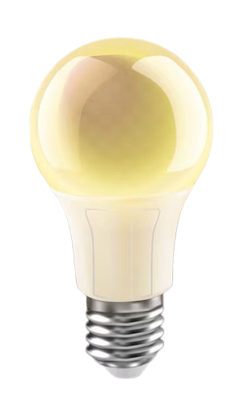

This project demonstrates a simple ON/OFF functionality for a bulb using JavaScript. When the button is clicked, it toggles the bulb image between ON and OFF states, providing visual feedback to the user. This is a basic example suitable for beginners learning JavaScript and DOM manipulation.

Table of Contents
Introduction
Features
Prerequisites
Installation
Usage
Code Overview
HTML
JavaScript
Contributing
License
Introduction
The Bulb ON/OFF project is a straightforward example of how to manipulate the DOM using JavaScript. It helps understand event handling and updating the UI based on user interactions. The bulb starts in the ON state and changes to OFF when clicked, and vice versa.

Features
Toggle bulb state between ON and OFF
Visual feedback indicating the current state of the bulb
Simple and clean design
Easy to understand and extend
Prerequisites
To run this project, you will need:

A web browser (Chrome, Firefox, Safari, etc.)
Basic knowledge of HTML and JavaScript
Installation
Clone the repository or download the zip file.

bash
Copy code
git clone https://github.com/yourusername/bulb-on-off.git
Navigate to the project directory.

bash
Copy code
cd bulb-on-off
Ensure you have the bulb images (bulb-on.png and bulb-off.png) in the same directory as your HTML file.

Usage
Open the index.html file in your web browser.

You will see a bulb image and two buttons labeled "Light ON" and "Light OFF".

Click the "Light ON" button to turn the bulb on and the "Light OFF" button to turn the bulb off.

Code Overview
HTML
The HTML file includes the structure of the webpage, the image element for the bulb, and the buttons to control the bulb state.

html
Copy code
<!DOCTYPE html>
<html lang="en">
<head>
    <title>Bulb ON/OFF </title>
    
</head> 
<body>
   <h1>BULB On/Off</h1>
   
Clicking on Light ON button turn On the bulb and vice-versa

   

   
   

      <button type="button" onclick="light(1)">Light ON</button>
      <button type="button" onclick="light(0)">Light OFF</button>
   

   

</body>
</html>
JavaScript
The JavaScript code is embedded within the HTML file. It defines the function to change the bulb image source based on the button clicked.

javascript
Copy code
function light(show){
    var pic;
    if(show==0){
        pic="bulb-off.png";
    }
    else{
        pic="bulb-on.png";
    }
    document.getElementById('bulb').src=pic;
}
Contributing
Contributions are welcome! If you have suggestions for improvements or want to report a bug, please open an issue or submit a pull request.

License
This project is licensed under the MIT License. See the LICENSE file for more details.

Feel free to modify this README to suit your project's specific details and needs.
